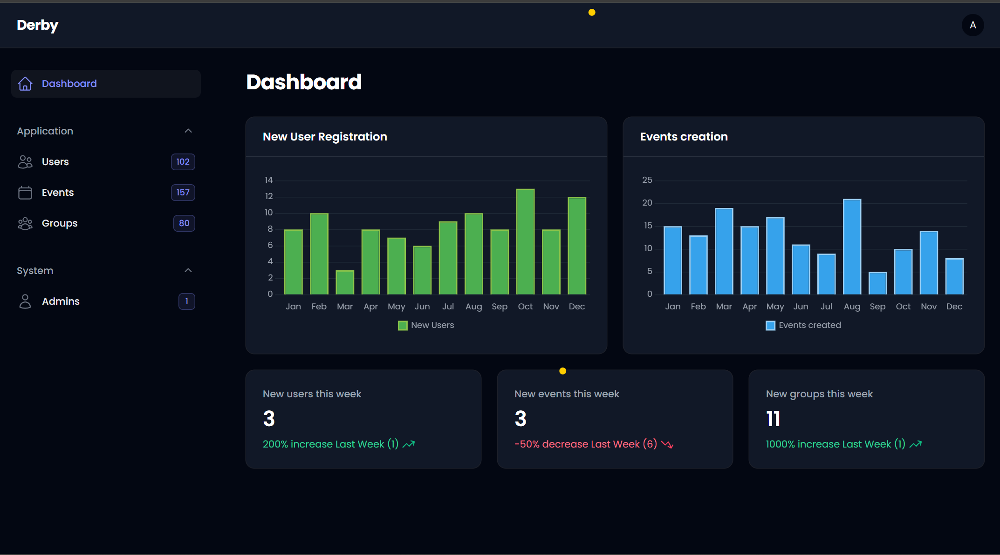
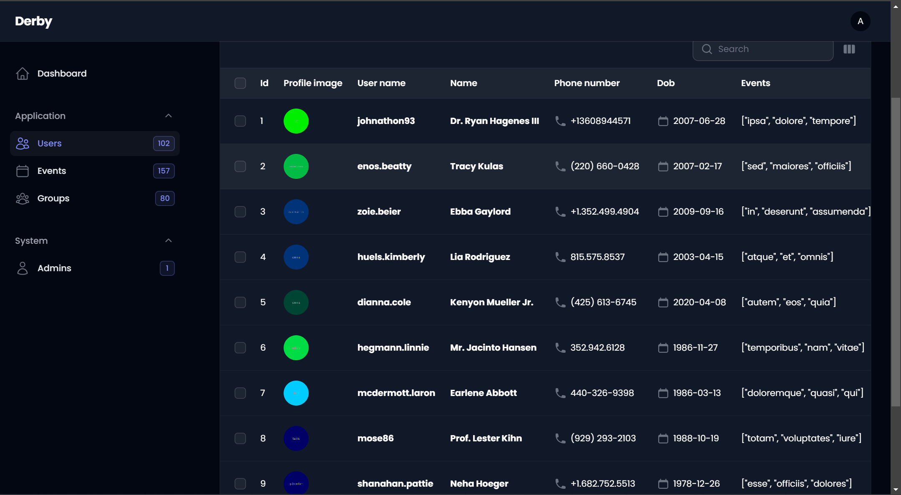
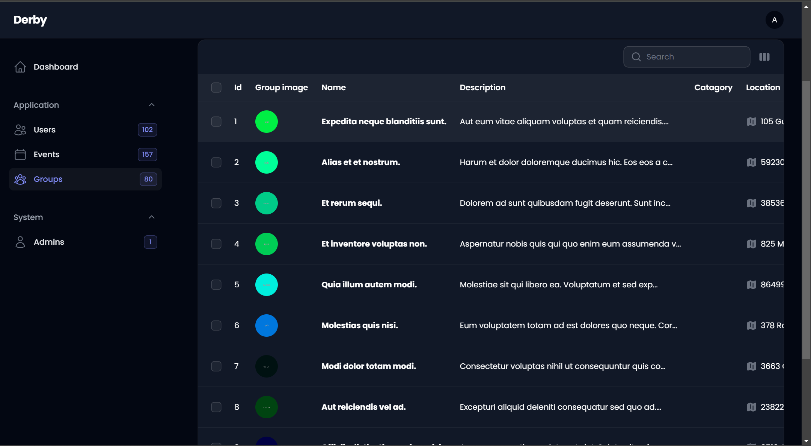

# Derpy Website

Welcome to the admin website for the Derpy application, where you can explore analytics and manage data using the Derpy API.

# How it Works

This admin website utilizes the API provided by Supabase, which is the backend infrastructure used by the Derpy application. The API allows us to access various data related to the Derpy application, such as user information, events, and groups. We use the Filament UI framework to build an intuitive and user-friendly interface for displaying and interacting with this data.

# Tools Used in This Project

## Laravel

Laravel is a PHP framework that provides a robust set of tools for building web applications. We chose Laravel for its expressive syntax, powerful features, and extensive ecosystem of packages.

## Filament

Filament is a Laravel package that offers a beautiful and customizable administration panel. It simplifies the process of building backend interfaces by providing pre-built components and layouts.

## Supabase

Supabase is an open-source alternative to Firebase that provides a suite of tools for building scalable and secure web applications. We leverage Supabase's API to interact with the Derpy application's data stored in the database.

## API

The API serves as the bridge between our admin website and the Derpy application's backend. It allows us to fetch, create, update, and delete data, enabling seamless integration between the two systems.

## Features

-   Data Analytics: Gain insights into user activity, event attendance, and group engagement through interactive charts and graphs.
-   Data Management: Perform CRUD operations on user accounts, events, and groups, empowering administrators to maintain and organize data effectively.
-   Customization: Tailor the admin interface to suit your specific needs with Filament's customizable components and layouts.

# Screenshots

## Dashboard

## User Table

## Group Table

